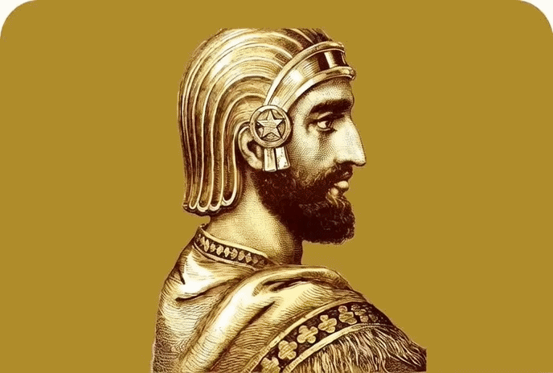

<div align="center">
  
</div>


### Dear ones, the photos uploaded in the repo are for you to get ideas and for generating images with different styles; you can use them.🫡✨


## **Prompt for creating images to advertise products:**

Build for me {```Product Name```: you can use the photo I uploaded} {```Inspired by```: this part is optional, you can leave it blank or say, 
for example, Elon Musk {```Style Type``` } with the above details and studio lighting {Additional description about the environment, character, and idea you have in mind that you want to be created...}


---
### **A prompt for generating a product name or a store name:**


Generate ten perfect names for {```product```} {```Inspired by:``` (**this part is optional**)} that have 
```seed word```: words you want in the name,
```product names```: close to the product and give a few easy examples. 
Put the names in a table and score them based on catchiness, uniqueness, simplicity. Apply the Goody function to each name and give a score based on the Goody function.

<div align="center">
  
</div>


---

## **A useful prompt (you can ask any question and even turn it into a translator).**

For example:

1__Man: Excuse me, my Spanish isn’t very strong. Can you help me? Everyone here speaks Spanish and I don’t understand anything. Can you be my translator so I can say what I want to this person?


Translator:


---

## **A prompt for detecting whether comments and messages are positive or negative (very useful for creating data in CSV format for GPT):**


Positive: My friend Sara bought a Gucci t-shirt from this store yesterday. She was really satisfied with it and kept praising it. At first, I thought this store was selling fake Gucci items, but after checking the quality of the clothes, the logo on the back, and doing some research online about this model, I was sure it’s authentic. I also ordered one for myself from them.

Negative: Yesterday, I went into a shoe store that claimed to sell authentic items and bought a pair of Nike shoes. It felt like I was wearing boots they were so heavy on my feet, and the material was really awful. I asked some of my friends who always buy branded items, and I found out they gave me a fake pair.

Predict: My dad and mom bought me a super cute wool sweater for my birthday as a gift, and I love it. The more I look at it, the more excited I get.


---
## **A prompt for easily explaining difficult concepts:**

Please explain the topic {...} as if you are talking to a 5-year-old (depending on your choice, it can also be a teenager, a student, etc.).


---

## **A prompt for writing articles and books:**

Sometimes we want to write an article or a book, and GPT tokens may not support it. In that case, we use the following prompt:


Can you give me a general structure and writing format for an article on {digital marketing}?

When AI has structured it for you, then ask it to explain each section fully and in detail, and finally combine all the writing components together for you.😊

---

## **A prompt for translation:**
Step 1: Take any text enclosed in triple quotation marks, summarize it, and place it next to "summary."

Step 2: Now translate the summarized text into Spanish and place it next to "translate."


---

## **A prompt for presenting in any format or gathering information:**

Set your GPT or AI to search mode and ask it to gather information from the web about the topic you want to present. You can request this information in CSV or PowerPoint format, and it will share it with you for download (●'◡'●).

Please gather information about {artificial intelligence}, including the first people who developed it, its current status in today’s world, and its perception among the public, and present it to me as a professionally designed PowerPoint.

---

## **A prompt for gathering more detailed and precise information:**

To get complete information about any topic, another way is to introduce yourself as an important person related to that topic and ask them to help you and provide the requested information🫡

I am a {professional marketer with a PhD in marketing}. Please explain the topic of marketing strategy in full for those who don’t know, and guide me in completing my article.

---

## **A prompt to limit the model to its own verified knowledge so that it does not fabricate information:**

With this prompt, you gather information from the internet and place it within triple quotation marks, then ask GPT a question. GPT will answer only based on the quoted information and will not generate anything else, allowing you to proceed with your work safely.


"""What is a marketer?
A marketer’s mission is to propose, develop, implement, and oversee marketing strategies, goals, and plans, manage the brand, as well as develop customer communication solutions and increase their satisfaction.(Correct information?
)""

I want you to answer the following question only by referring to the above text (enclosed in triple quotation marks). If you don’t have an answer, simply respond with ""I don’t know"".

Is a marketer someone who buys and sells fruit?(It will definitely answer "I don’t know" because the information is not in the triple quotes.
)

---

## **A prompt for creating a prompt:**

Sometimes you can get help from the AI itself to create a prompt about the topic you want, or another method is to say: “I am a prompt expert.” Please provide me with a prompt structure, for example, for generating a car image.


1_Please give me a prompt to generate 10 ultra-professional Instagram bios for me✨


2_I am a prompt writing expert. Can you give me a prompt structure for generating an image of my product?

---

### **A prompt for writing a job promotion request letter:**

I want to request a job promotion from my boss. Use the following information to create an attractive and effective letter:
Information about yourself:

* Years I’ve worked: 
* My boss’s name: 
* My job: 
and...

{Before writing the letter, if you don’t have all the necessary information to perform the task, avoid doing it and ask for more information.}(This part is very important because it prevents the message from being too simple or incomplete.)

---

## **A prompt for summarizing and comparing information:**

Summarize the text enclosed in triple quotation marks: """My father is happy"""
Now compare the summarized text, enclosed in triple quotation marks, with [My father is happy].
Provide a final answer indicating whether the text in brackets and the summarized text are similar in meaning or not.

---

## **A prompt for reducing AI hallucination::**

This is the magic sentence: ```Take it step by step```
By just saying this sentence, the AI’s hallucination rate is greatly reduced or it may not hallucinate at all.

Please go step by step and tell me the number of smokers in the world.


## **A prompt for writing an article:**

Create an article with 20 subheadings about the 2008 financial crisis.

Like one of the previous examples, we copy each section that is sent to us and send it back, asking it to explain that section fully, in detail, and usefully.

***The reason for doing this is the token limitation in GPT, which we mentioned earlier in one of the examples***

---

## **A prompt for selecting a professional title or providing 5 average titles:**


**Text**:Life is not something that simply happens; life is something that is slowly built right in the heart of small choices, doubts, fears, and hopes. We often wait for a special moment for life to “begin”: when we reach a goal, when things calm down, when we succeed, when we finally feel complete. But the truth is, life is happening right now in these ordinary breaths, in these days that may look similar but each one quietly shapes a part of who we are.

Sometimes life is kind, and sometimes it is cruel. There are days when everything flows easily, and days when it feels like the whole world is working against us. Yet strangely, most of our growth happens in those difficult days when we are forced to become stronger, when we learn to let go, when we realize not everything is under our control, and still, we remain responsible for our choices.

Life teaches us that people come and go. Some stay, and some become lessons. We learn that loving is beautiful, but attachment can be painful. We learn that sometimes loving someone doesn’t mean holding on, but having the courage to let go. These realizations may hurt, but they make us deeper, more aware, more human.

Life is about falling and getting back up, even when our knees still ache. It is about continuing not because we are always hopeful, but because we learn that hopelessness is also part of the journey. It is about accepting that we are not perfect, but we are becoming. Life is not a race; comparing ourselves to others only pulls us away from our own path. Everyone has their own timing, their own struggles, and dreams that only they truly understand.

In the end, life may be less about arriving and more about understanding understanding ourselves, the value of moments, and the truth that happiness is not always waiting in the future. Sometimes, it is right beside us. Life is learning to pause, even in the middle of chaos and exhaustion, and say: “I am still here. I am still trying. And that, in itself, is enough.


**Title**:"Life in the Moments: A Journey of Awareness, Choice, and Growth"


**Text**:"""Sometimes life feels like a foggy road not because there is no destination, but because we haven’t yet dared to walk far enough for the path to reveal itself. We often wait for everything to become clear before we move forward, when the truth is that clarity is the reward of movement, not a prerequisite for it.

Growth doesn’t always arrive loudly. Sometimes it’s very quiet in a small decision, in finally saying “no,” in saying “yes” without letting fear decide, in letting go of something that once meant everything to us. Growth means accepting that the old version of us, despite all the effort it made, isn’t meant to stay in control of our life forever.

As humans, we are strangely addicted to comparison. We measure ourselves against people who are living completely different seasons of life. We forget that everyone has their own timing. Some people bloom later, but they grow deeper roots. Some move slowly, but they don’t lose their way. Speed is not a sign of success direction matters more.

Life isn’t meant to be motivating all the time. Some days, you simply have to endure. Some days, the only victory is that you didn’t give up. This, too, is part of the journey not a sign of weakness. Strength means continuing even when you’re not sure you’re on the right path, but you know that standing still no longer works.

And perhaps the most important lesson of all: you don’t need to be a finished version of yourself to be worthy. Being on the path of becoming better is enough. The fact that you question, reflect, and want to grow means you are alive truly alive.

So if you’re tired today, that’s okay. If you feel lost, that’s natural. Just remember: you are a work in progress, not a failure. Be kinder to yourself, trust your journey, and allow life to reveal itself to you one step at a time """


For the text enclosed in triple quotation marks, please choose the single best title you think is most suitable. If you don’t have a useful and professional title, just say “I don’t know” and provide 5 titles that you think are not bad.

**Title**:
___

### **A prompt for generating images or videos:**

One of the ways you can make your work easier is by converting your text into JSON format.

```json
{
  "vibe": "{}",
  "style": "{}",
  "traitsPersonality, physical appearance, and moral traitsPersonality, physical appearance, and moral traits": "{}",
  "age": "{}",
    "Description":"{}",
    "The place where he/she is present":"{}"
 
  }
```

---

### **A prompt for generating images or videos:(2)**

You can split the text into sections to generate images or videos more effectively.

Section 1:{.....}


Section 2:{.....}

---

### **A prompt for getting better results in any topic:**

You are a {{professional marketing expert}} who can answer any question related to this topic. You are highly skilled and intelligent in your field and capable of answering any question by researching, not by making things up. If the user asks you not to use complicated or fancy words, explain the topic in a simpler and clearer way. Otherwise, provide the most professional and advanced explanation you can.

---

### Prompt for generating realistic images and videos:


Using the phrase **35mm camera** greatly enhances the realism of your photos and videos don’t hesitate to include it! 😊

Create an image of a Chinese girl standing in front of her temple, wearing a beautiful long white dress with shiny golden embroidery at the bottom of the skirt, in a realistic and fully natural style, captured up close with a 35mm camera.


Example:

<p align="center">
</p>

This image was created with Google Gemini; it has good quality in creating realistic images, and when mixed with a prompt it works magic, and you have a completely realistic and natural image.


---
### Professional prompt for generating a video with a completely realistic style


Vertical 9:16 video with ```8K quality```, ```ultra realistic```, and ```completely cinematic```.
Bring this person to life while standing in a military camp in the heart of the desert, before the start of the war. Military tents are placed all over the field, and their fabric gently moves with the soft warm desert breeze. Soldiers in the background are calmly and naturally moving around preparing equipment, with ```organic and realistic movements```.

```Very high facial detail```, ```natural skin texture``` along with ```subtle and realistic imperfections```, ```accurate display of skin pores```, ```natural skin tone``` and ```without yellowish skin```. The character is wearing a full military hat that is not half-worn or defective.

```Slow``` and ```cinematic``` camera movement toward the character’s face (```gentle push-in```), with ```minimal natural movement``` and ```slight movement caused by breathing```.

```Filmed with a 35mm lens```, shallow depth of field and ```deep cinematic composition```.
```Appearance similar to filming with a professional DSLR camera```, ```subtle noise like real film```, ```natural color grading```.

```No CGI effects```, ```no cartoonish look```, ```no plastic skin```, ```no artificial shine```, ```no unrealistic lighting```, ```no over-sharpening```.


-----





---
### Prompt for bringing historical figures to life

Bring this portrait to life with a completely natural, photorealistic style, high detail, realistic skin texture, natural lighting, ultra realistic

(Generated with ChatGPT)

***Queen Catherine de' Medici from Florence, Italy, and former queen of France:***

[About she](https://www.bing.com/ck/a?!&&p=1494ac897ad1928f4888c11e0b032f903709d379b42df18f42cd534a62aef19bJmltdHM9MTc4MDg3NjgwMA&ptn=3&ver=2&hsh=4&fclid=0e0bc2c0-78f0-62c3-10e6-d47c799163ab&u=a1aHR0cHM6Ly9lbi53aWtpcGVkaWEub3JnL3dpa2kvQ2F0aGVyaW5lX2RlJTI3X01lZGljaQ)


<div align="center">
  <br><br>
 Result:
  <table>
    <tr>
      <td></td>
      <td></td>
    </tr>
  </table>
</div>


<div align="center">
another:

  <table>
    <tr>
      <td></td>
      <td></td>
    </tr>
  </table>
</div>

[About he](https://fa.wikipedia.org/wiki/%D8%B4%D8%A7%D9%87_%D8%A7%D8%B3%D9%85%D8%A7%D8%B9%DB%8C%D9%84_%DB%8C%DA%A9%D9%85)


### Prompt for gaming style:

(For the idea of making a video for yourself) The gaming and play style is a nice style✨


